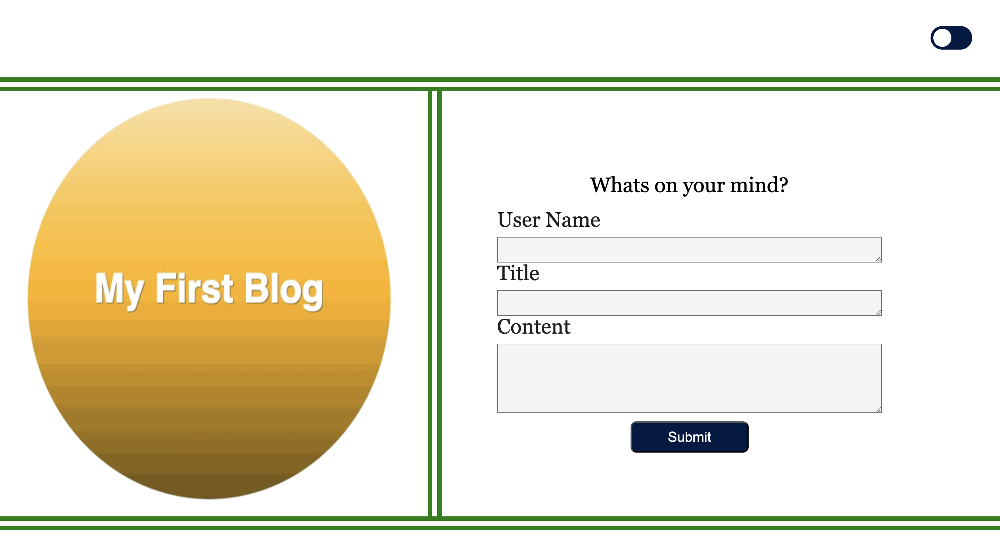

# personal-blog

Scope of work:

In this challenge, I create a two-page website where users will input and view blog posts by the user. It includes building a content form.
During this code, I gained practical JavaScript experience, explore the Document Object Model's power, and set the stage for more advanced tasks.

## Website

click link to view [website](https://ejacosta86.github.io/personal-blog/).

## Preview

## License

[MIT](https://choosealicense.com/licenses/mit/)

## Collabortation 

Made within partnership with [Michael Duffey ](https://github.com/Mtduffey36/marketing-blog)